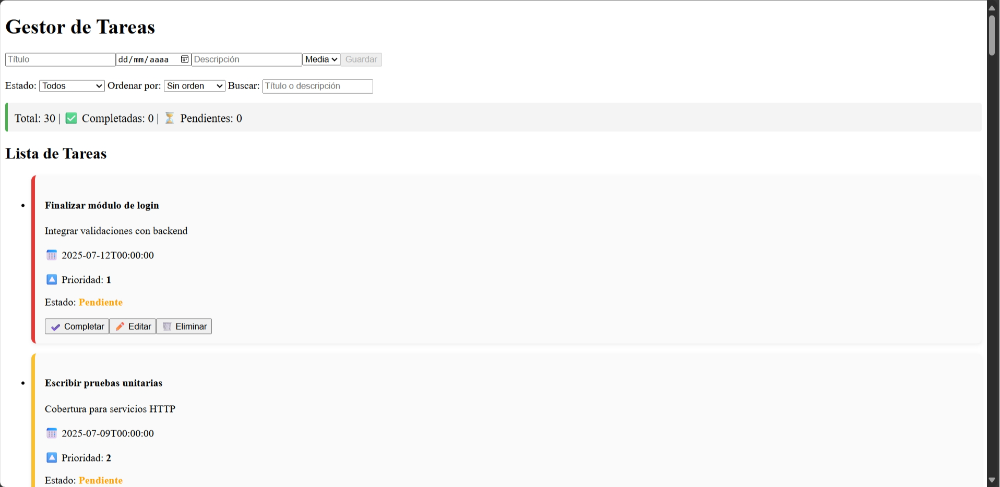
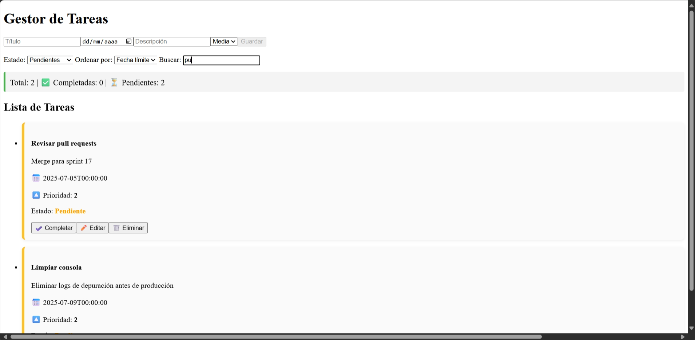
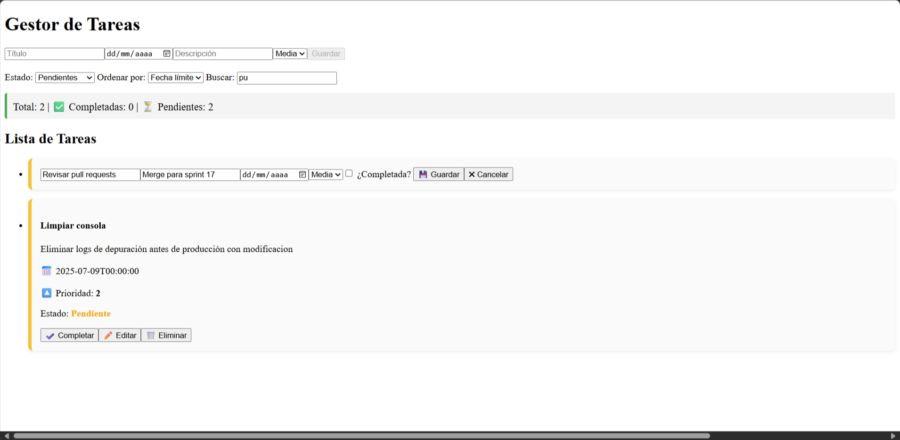
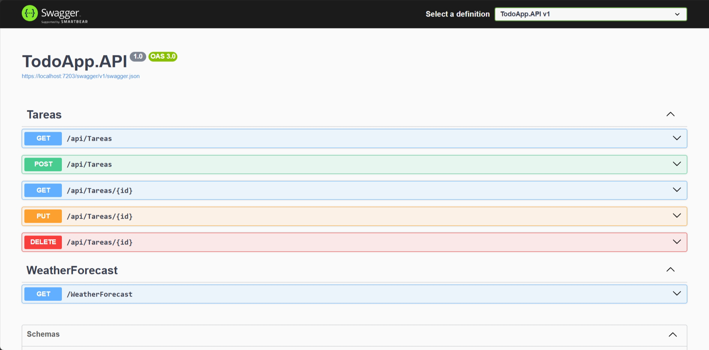
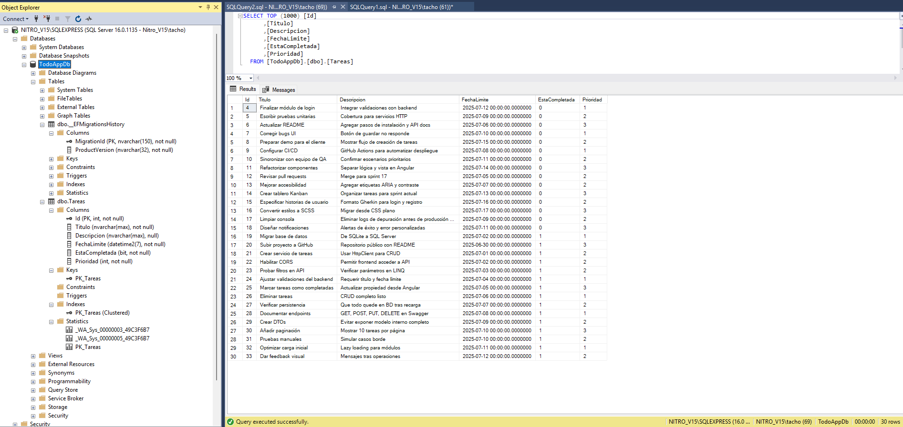

# Examen1_Progra6_RaulOrtega

Aplicación full stack de gestión de tareas con Angular y .NET Core. Permite crear, editar, eliminar, filtrar y completar tareas. Incluye API REST, filtros dinámicos, resumen estadístico, estilos visuales y documentación técnica para uso y referencia futura.

# 📝 Gestor de Tareas – Angular + .NET Web API

Este proyecto implementa una aplicación full stack para gestionar tareas, con operaciones CRUD completas, filtros avanzados y documentación técnica. Desarrollado en Angular 18+ para el frontend y ASP.NET Core 8 para la API.

---

## 📸 Evidencia visual

### 📋 Lista de tareas activa

---

### 🎛️ Filtros aplicados + resumen

---

### ✏️ Modo edición de tarea

---

### 📬 Swagger UI de la API funcionando

---

### 📦 Base de datos creada por migración

---

## ⚙️ Tecnologías utilizadas

| Frontend    | Backend/API           | Base de Datos       |
| ----------- | --------------------- | ------------------- |
| Angular 16+ | ASP.NET Core Web API  | SQL Server Express  |
| HTML / CSS  | Entity Framework Core | EF Core Migrations  |
| TypeScript  | CORS + Swagger        | .NET CLI compatible |

---

## 🧭 Estructura del proyecto

/TodoApp.UI → Proyecto Angular completo (frontend)
/TodoApp.API → Proyecto .NET Core (API REST)
/TodoApp.Data → Modelo de datos + DbContext
/TodoApp.sln → Solución raíz de Visual Studio
/screenshots/ → Capturas de pantalla para evidencia

---

## 🧪 Requisitos para correr localmente

### 🔸 Angular (TodoApp.UI)

- Node.js v18 o superior
- Angular CLI
- `npm install` en `/TodoApp.UI`

### 🔸 API .NET (TodoApp.API)

- .NET 8 SDK o superior
- SQL Server Express
- Ejecutar migración con:
  dotnet ef database update --project TodoApp.Data

---

## 🚀 Pasos para ejecución

### 1. Ejecutar backend (.NET)

cd TodoApp.API
dotnet run

URL por defecto: https://localhost:7203

---

### 2. Ejecutar frontend (Angular)

cd TodoApp.UI
npm install
ng serve

URL local: http://localhost:4200

---

## 🔐 CORS

La política AllowAngularApp permite llamadas desde http://localhost:4200. Configurada en Program.cs.

---

## ✅ Funcionalidades confirmadas

- [x] Crear, editar y eliminar tareas
- [x] Marcar tareas como completadas
- [x] Filtrar por estado, prioridad y búsqueda textual
- [x] Mostrar resumen (total/completadas/pendientes)
- [x] API REST funcional y documentada (Swagger)
- [x] EF Core y migraciones funcionando

---

## 📄 Licencia

Proyecto libre para uso educativo, técnico o como plantilla personal. Reutilizable bajo principios de atribución.

---

## 🙌 Autor

Desarrollado por **Raul Ortega Acuña** como solución técnica Angular + .NET  
Incluye documentación técnica comentada línea por línea.